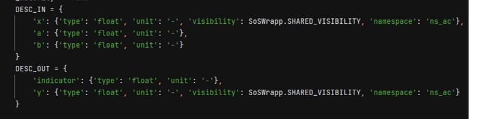
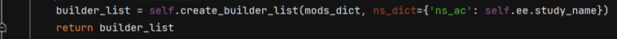
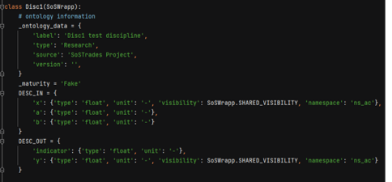
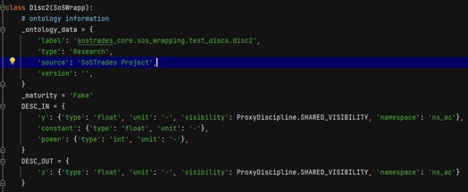
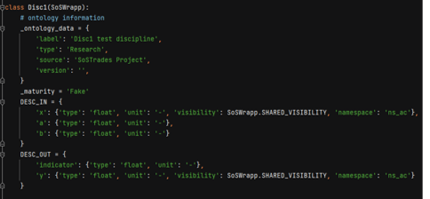
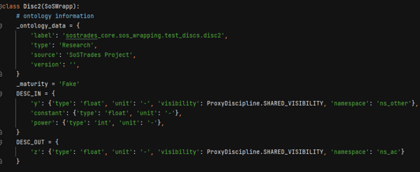
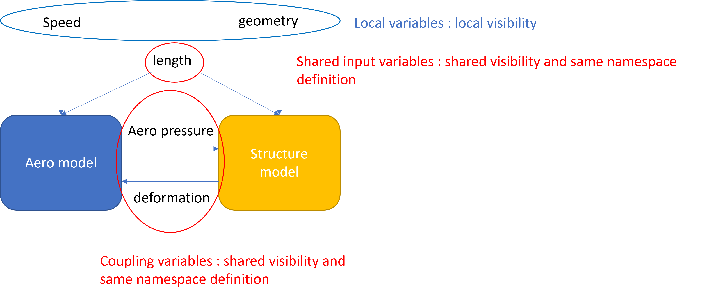

# Namespace

In GEMSEO, coupling is done automatically through the names of variables.\
In SosTrades we want to avoid unwanted couplings between variables that may have the same name. Namespaces have been introduced to prevent this.

Coupling is done through namespaces on your wrappers’ inputs/outputs definition.

Namespaces are used to set prefixes in front of the variable names to:
* Avoid unwanted matches of variables
* Choose a suitable data tree breakdown
* Organize the data location in the GUI

## Visibility possibilities : 

**Local** (default visibility) : the variable is stored at the root of the discipline

Example : The variable a will be stored in study_name.Disc1.a

**Shared** : the variable is stored in a given namespace which must be filled in the variable definition.

Example : The variable x will be stored in the namespace ‘ns_ac’. The value of ‘ns_ac’ is defined in each process using the discipline (allowing flexibility depending on the process)\
If in the process is define as follow: 
>x will be stored in study_name.x

## Using namespaces to couple models (disciplines)
You need to define the same shared namespace for the same variable.

Coupling variable between Disc 1 and Disc2:

No coupling variables, Disc1 and Disc2 are independent:

## Using namespaces to share input variable
You need to define the same shared namespace for the shared variable.

### Example : Aero-structure model coupling

