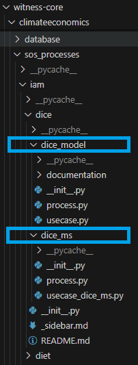

# Create a Process


A process class is built in a process.py file\
It heritates from **BaseProcessBuilder**\
A method **get_builders** must return a list of builders based on a dict of **SoSWrapp**\
The **mods_dict** keys are the names of the discipline in the process associated to the path to the wrapper\
The method **create_builder_list** create a list of builders with **mods_dict** and can also build needed namespaces. [see namespace](../caption/namespace.md)

**Models repository architecture**



The folder name gives the name of the process (here dice_model and dice_ms) and must be stored in a sos_processes folder (to be visible in the GUI)


## Process with multiple models

Example of a process with 2 disciplines Disc1 and Disc2\
process.py:

```python

from sostrades_core.sos_processes.base_process_builder import BaseProcessBuilder
from sostrades_core.tools.post_processing.charts.chart_filter import ChartFilter
from sostrades_core.tools.post_processing.charts.two_axes_instanciated_chart import TwoAxesInstanciatedChart, \
    InstanciatedSeries
from sostrades_core.execution_engine.data_manager import DataManager

class ProcessBuilder(BaseProcessBuilder):

    # ontology information
    _ontology_data = {
        'label': 'Core Test Disc1 Disc2 Coupling Process',
        'description': '',
        'category': '',
        'version': '',
    }

    def get_builders(self):
        disc_dir = 'sostrades_core.sos_wrapping.test_discs.'
        mods_dict = {'Disc1': disc_dir + 'disc1.Disc1',
                     'Disc2': disc_dir + 'disc2.Disc2', }
        builder_list = self.create_builder_list(mods_dict, ns_dict={'ns_ac': self.ee.study_name})
        self.ee.post_processing_manager.add_post_processing_functions_to_namespace(
            'ns_ac', post_processing_filters, post_processings)
        self.ee.post_processing_manager.add_post_processing_module_to_namespace(
            'ns_ac', 'sostrades_core.sos_processes.test.test_disc1_disc2_coupling.post_processing_libraries')
    
        return builder_list

```


